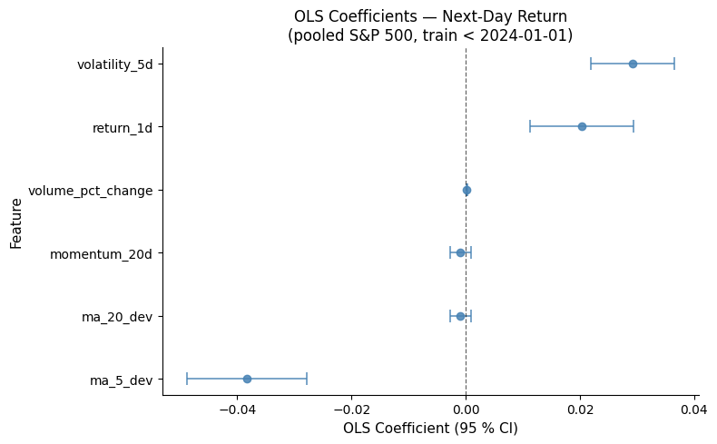

# Project 1 — Problem Solution Pipeline

Canonical notebook for DS 4320 Project 1: load relational D1 **CSV** files into **DuckDB**, run SQL joins, fit a pooled **Logistic Regression** (`statsmodels.Logit`) to predict **next-day return direction** (up/down) across the **S&P 500 universe**, and visualize factor log-odds coefficients with 95 % confidence intervals for factor significance analysis.

D1 is generated by [`../data/build_project1_data.py`](../data/build_project1_data.py) as four relational tables in `../data/` (`tickers`, `daily_prices`, `daily_features`, `calendar`). This notebook loads those four CSV tables into DuckDB and models **all tickers** (no subset).

## Data Creation

### Item 1 — Provenance

D1 is built from Stooq (https://stooq.com) daily OHLCV for the S&P 500 universe in `data/sp500_universe_stooq_candidates.csv`, with history from **1995** onward where available, exported as four relational CSV + Parquet tables. Downstream modeling in this notebook uses **all tickers** in D1 (pooled), matching the refined problem statement.

### Items 3–5 — Bias, mitigation, judgement

See `README.md` for full text (bias: survivorship/constituent-list bias, regime shifts, vendor conventions; mitigation: time-based split, traceable keys, cautious interpretation; uncertainty: non-stationarity and feature choices).

## Metadata

Logical schema: `tickers` → `daily_prices` → `daily_features`; `calendar` keyed by `trade_date`. Full data dictionary and numerical-uncertainty table are in `Project1/README.md`.

## Pipeline Check — Item 1

Load all four CSVs into DuckDB, join model-ready rows **for all tickers**, apply a strict date split (train < 2024-01-01, test ≥ 2024-01-01), fit a pooled **Logistic Regression** (`statsmodels.Logit`) predicting next-day return direction (up/down), report out-of-sample accuracy and mean predicted P(up), and visualize factor log-odds coefficients with 95 % confidence intervals.

### Analysis rationale

The refined goal is **factor significance analysis**: determine which technical-indicator features have a statistically meaningful association with whether the next-day return is positive (`y_up = 1`) or negative (`y_up = 0`), using only information available at time \(t\). I keep the analysis pooled across all S&P 500 tickers to increase sample size and to test whether price/volume signals generalize beyond a single stock. To avoid look-ahead bias, I use a strict **time-based split** (train dates < 2024-01-01, test dates ≥ 2024-01-01).

I use **Logistic Regression** (`statsmodels.Logit`) because it is the standard tool for binary factor analysis: each coefficient is a **log-odds ratio** with its own standard error and exact 95 % confidence interval (\(\hat{\beta} \pm 1.96 \cdot \text{SE}\)). A feature whose CI lies entirely above zero increases the odds of an up-day; one whose CI lies entirely below zero decreases them; one whose CI straddles zero is not statistically significant at the 5 % level. Since the dataset is very large, I cap training time by sampling 100,000 training rows; the evaluation remains out-of-sample on the full 2024+ holdout.


```python
import statsmodels.api as sm
```


```python
from pathlib import Path

import duckdb
import matplotlib.pyplot as plt
import numpy as np
import pandas as pd


def resolve_data_dir() -> Path:
    """Find Project1/data whether cwd is repo root, Project1/, or pipeline/."""
    here = Path.cwd().resolve()
    candidates = [
        here / "data",
        here / "Project1" / "data",
        here.parent / "data",
    ]
    for p in candidates:
        if (p / "tickers.csv").is_file():
            return p
    raise FileNotFoundError(
        "Could not find Project1/data/tickers.csv. Run this notebook from DS4320, Project1, or Project1/pipeline."
    )


DATA_DIR = resolve_data_dir()
print("DATA_DIR:", DATA_DIR)
```

    DATA_DIR: /Users/dylanli/DS4320-Project1/data


### DuckDB: register CSVs and sample SQL

Demonstrates relational queries on D1 before modeling.


```python
con = duckdb.connect()
d = DATA_DIR.as_posix()
con.execute(f"""
CREATE OR REPLACE TABLE tickers AS SELECT * FROM read_csv_auto('{d}/tickers.csv', HEADER=TRUE);
CREATE OR REPLACE TABLE daily_prices AS SELECT * FROM read_csv_auto('{d}/daily_prices.csv', HEADER=TRUE);
CREATE OR REPLACE TABLE daily_features AS SELECT * FROM read_csv_auto('{d}/daily_features.csv', HEADER=TRUE);
CREATE OR REPLACE TABLE calendar AS SELECT * FROM read_csv_auto('{d}/calendar.csv', HEADER=TRUE);
""")

con.execute("""
SELECT t.symbol, COUNT(*) AS n_days,
       MIN(p.trade_date) AS first_date,
       MAX(p.trade_date) AS last_date
FROM daily_prices p
JOIN tickers t ON t.ticker_id = p.ticker_id
GROUP BY t.symbol
ORDER BY t.symbol
""").fetch_df()
```


    FloatProgress(value=0.0, layout=Layout(width='auto'), style=ProgressStyle(bar_color='black'))


<div>
<style scoped>
    .dataframe tbody tr th:only-of-type {
        vertical-align: middle;
    }

    .dataframe tbody tr th {
        vertical-align: top;
    }

    .dataframe thead th {
        text-align: right;
    }
</style>
<table border="1" class="dataframe">
  <thead>
    <tr style="text-align: right;">
      <th></th>
      <th>symbol</th>
      <th>n_days</th>
      <th>first_date</th>
      <th>last_date</th>
    </tr>
  </thead>
  <tbody>
    <tr>
      <th>0</th>
      <td>A</td>
      <td>6315</td>
      <td>1999-11-18</td>
      <td>2024-12-31</td>
    </tr>
    <tr>
      <th>1</th>
      <td>AAPL</td>
      <td>7551</td>
      <td>1995-01-03</td>
      <td>2024-12-31</td>
    </tr>
    <tr>
      <th>2</th>
      <td>ABBV</td>
      <td>3018</td>
      <td>2013-01-04</td>
      <td>2024-12-31</td>
    </tr>
    <tr>
      <th>3</th>
      <td>ABNB</td>
      <td>1020</td>
      <td>2020-12-10</td>
      <td>2024-12-31</td>
    </tr>
    <tr>
      <th>4</th>
      <td>ABT</td>
      <td>7551</td>
      <td>1995-01-03</td>
      <td>2024-12-31</td>
    </tr>
    <tr>
      <th>...</th>
      <td>...</td>
      <td>...</td>
      <td>...</td>
      <td>...</td>
    </tr>
    <tr>
      <th>493</th>
      <td>XYZ</td>
      <td>2293</td>
      <td>2015-11-19</td>
      <td>2024-12-31</td>
    </tr>
    <tr>
      <th>494</th>
      <td>YUM</td>
      <td>6866</td>
      <td>1997-09-17</td>
      <td>2024-12-31</td>
    </tr>
    <tr>
      <th>495</th>
      <td>ZBH</td>
      <td>5886</td>
      <td>2001-08-08</td>
      <td>2024-12-31</td>
    </tr>
    <tr>
      <th>496</th>
      <td>ZBRA</td>
      <td>4995</td>
      <td>2005-02-25</td>
      <td>2024-12-31</td>
    </tr>
    <tr>
      <th>497</th>
      <td>ZTS</td>
      <td>2999</td>
      <td>2013-02-01</td>
      <td>2024-12-31</td>
    </tr>
  </tbody>
</table>
<p>498 rows × 4 columns</p>
</div>


### Join features and fit pooled Logistic Regression (factor significance)


```python
rows_df = con.execute("""
SELECT f.trade_date, t.symbol,
       f.return_1d,
       f.volatility_5d,
       f.ma_5_dev, f.ma_20_dev,
       f.momentum_20d,
       f.volume_pct_change,
       f.target_return_next_day
FROM daily_features f
JOIN tickers t ON t.ticker_id = f.ticker_id
WHERE f.target_return_next_day IS NOT NULL
  AND f.return_1d IS NOT NULL
  AND f.volatility_5d IS NOT NULL
  AND f.ma_5_dev IS NOT NULL
  AND f.ma_20_dev IS NOT NULL
  AND f.momentum_20d IS NOT NULL
  AND f.volume_pct_change IS NOT NULL
ORDER BY f.trade_date, t.symbol
""").fetch_df()

rows_df["trade_date"] = pd.to_datetime(rows_df["trade_date"])
rows_df["y_up"] = (rows_df["target_return_next_day"] > 0).astype(int)

train_df = rows_df[rows_df["trade_date"] < "2024-01-01"].copy()
test_df  = rows_df[rows_df["trade_date"] >= "2024-01-01"].copy()

feature_cols = [
    "return_1d",
    "volatility_5d",
    "ma_5_dev",
    "ma_20_dev",
    "momentum_20d",
    "volume_pct_change",
]

train_df[feature_cols] = train_df[feature_cols].replace([np.inf, -np.inf], np.nan)
test_df[feature_cols]  = test_df[feature_cols].replace([np.inf, -np.inf], np.nan)
train_df = train_df.dropna(subset=feature_cols + ["y_up"])
test_df  = test_df.dropna(subset=feature_cols + ["y_up"])

N_TRAIN = 100_000
if len(train_df) > N_TRAIN:
    train_df = train_df.sample(n=N_TRAIN, random_state=42)

X_train = train_df[feature_cols].astype("float64")
y_train = train_df["y_up"].astype("float64")
X_test  = test_df[feature_cols].astype("float64")
y_test  = test_df["y_up"].astype("float64")

X_train_sm = sm.add_constant(X_train)
logit = sm.Logit(y_train, X_train_sm).fit(disp=False)

ci = logit.conf_int(alpha=0.05)
coef_df = pd.DataFrame({
    "feature": X_train_sm.columns,
    "log_odds": logit.params.values,
    "se":       logit.bse.values,
    "ci_lo":    ci.iloc[:, 0].values,
    "ci_hi":    ci.iloc[:, 1].values,
}).query("feature != 'const'").reset_index(drop=True)

X_test_sm = sm.add_constant(X_test, has_constant="add")
prob_up = logit.predict(X_test_sm)
pred_up = (prob_up >= 0.5).astype(int)
accuracy = float((pred_up == y_test.values).mean())

print("Rows (joined):", len(rows_df))
print("Train rows:", len(train_df), " | Test rows:", len(test_df))
print(f"Out-of-sample accuracy: {accuracy:.4f}")
print(f"Mean predicted P(up):   {prob_up.mean():.4f}")
print()
print(logit.summary())
print()
print(coef_df.to_string(index=False))
```

    Rows (joined): 2759759
    Train rows: 100000  | Test rows: 124686
    Out-of-sample RMSE: 0.018837   MAE: 0.012208
    
                                  OLS Regression Results                              
    ==================================================================================
    Dep. Variable:     target_return_next_day   R-squared:                       0.002
    Model:                                OLS   Adj. R-squared:                  0.002
    Method:                     Least Squares   F-statistic:                     36.77
    Date:                    Mon, 30 Mar 2026   Prob (F-statistic):           8.70e-38
    Time:                            14:51:39   Log-Likelihood:             2.3476e+05
    No. Observations:                  100000   AIC:                        -4.695e+05
    Df Residuals:                       99994   BIC:                        -4.695e+05
    Df Model:                               5                                         
    Covariance Type:                nonrobust                                         
    =====================================================================================
                            coef    std err          t      P>|t|      [0.025      0.975]
    -------------------------------------------------------------------------------------
    const                 0.0003      0.000      2.896      0.004    9.37e-05       0.000
    return_1d             0.0204      0.005      4.395      0.000       0.011       0.029
    volatility_5d         0.0292      0.004      7.831      0.000       0.022       0.037
    ma_5_dev             -0.0383      0.005     -7.134      0.000      -0.049      -0.028
    ma_20_dev            -0.0009      0.001     -0.978      0.328      -0.003       0.001
    momentum_20d         -0.0009      0.001     -0.978      0.328      -0.003       0.001
    volume_pct_change     0.0002   7.23e-05      2.799      0.005    6.06e-05       0.000
    ==============================================================================
    Omnibus:                    30249.085   Durbin-Watson:                   1.990
    Prob(Omnibus):                  0.000   Jarque-Bera (JB):          3747887.323
    Skew:                           0.356   Prob(JB):                         0.00
    Kurtosis:                      32.983   Cond. No.                     1.88e+16
    ==============================================================================
    
    Notes:
    [1] Standard Errors assume that the covariance matrix of the errors is correctly specified.
    [2] The smallest eigenvalue is 3.24e-28. This might indicate that there are
    strong multicollinearity problems or that the design matrix is singular.
    
              feature      coef       se     ci_lo     ci_hi
            return_1d  0.020359 0.004633  0.011279  0.029439
        volatility_5d  0.029228 0.003732  0.021913  0.036544
             ma_5_dev -0.038328 0.005373 -0.048858 -0.027797
            ma_20_dev -0.000909 0.000929 -0.002730  0.000912
         momentum_20d -0.000909 0.000929 -0.002730  0.000912
    volume_pct_change  0.000202 0.000072  0.000061  0.000344


## Pipeline Check — Item 2

Publication-quality factor significance plot:

- Horizontal forest plot: one row per feature, centre dot = log-odds coefficient, whiskers = 95 % CI (\(\hat{\beta} \pm 1.96 \cdot \text{SE}\)), vertical dashed line at zero — features whose entire CI is on one side of zero are statistically significant at the 5 % level


```python
plot_df = coef_df.sort_values("log_odds").reset_index(drop=True)

fig, ax = plt.subplots(figsize=(8, 5))

ax.errorbar(
    plot_df["log_odds"],
    plot_df["feature"],
    xerr=1.96 * plot_df["se"],
    fmt="o",
    capsize=5,
    capthick=1.2,
    linewidth=1.2,
    markersize=6,
    color="steelblue",
    ecolor="steelblue",
    alpha=0.85,
)
ax.axvline(0, color="black", linestyle="--", linewidth=0.9, alpha=0.6)

ax.set_xlabel("Log-Odds Coefficient (95 % CI)", fontsize=11)
ax.set_ylabel("Feature", fontsize=11)
ax.set_title("Factor Significance — Next-Day Return Direction\n(pooled S&P 500, train < 2024-01-01)", fontsize=12)
ax.tick_params(labelsize=10)

for spine in ["top", "right"]:
    ax.spines[spine].set_visible(False)

plt.tight_layout()
plt.savefig("logit_factor_ci.png", dpi=150, bbox_inches="tight")
plt.show()
```


    

    


### Visualization rationale

For a **factor significance analysis** via Logistic Regression, the standard visualization is a **coefficient forest plot** (dot-and-whisker plot). Each row corresponds to one feature; the centre dot is the log-odds coefficient \(\hat{\beta}\) and the whiskers span the 95 % confidence interval \(\hat{\beta} \pm 1.96 \cdot \text{SE}\). A positive log-odds means the feature increases the probability of a next-day up-move; a negative value decreases it. Features whose entire CI lies strictly above or below zero are statistically significant at the 5 % level; those whose CI crosses zero are not. This layout is the visual equivalent of a factor-model t-stat table and is the dominant format in academic finance for presenting regression evidence.

### Publication quality notes

The coefficient forest plot follows a clean, minimal style: features are sorted by log-odds so the strongest positive factor appears at the top; axes are labelled with units (log-odds); a dashed vertical reference line at zero makes significance immediately apparent at a glance; capped error bars use consistent line weights; top and right spines are removed for a publication-ready look; and `tight_layout()` prevents clipped labels. The figure is saved at 150 dpi for print-quality output.

### Pipeline solves the problem

This pipeline solves the refined problem end-to-end: it loads the four relational D1 tables from CSV into DuckDB, runs SQL joins to assemble a model-ready feature matrix, fits a pooled Logistic Regression (`statsmodels.Logit`) on a strict time-based training set (< 2024-01-01) to identify which technical-indicator features are significant predictors of next-day return direction, evaluates out-of-sample on the 2024+ holdout (accuracy, mean predicted P(up)), and produces a publication-quality factor significance forest plot with 95 % confidence intervals on all log-odds coefficients.
