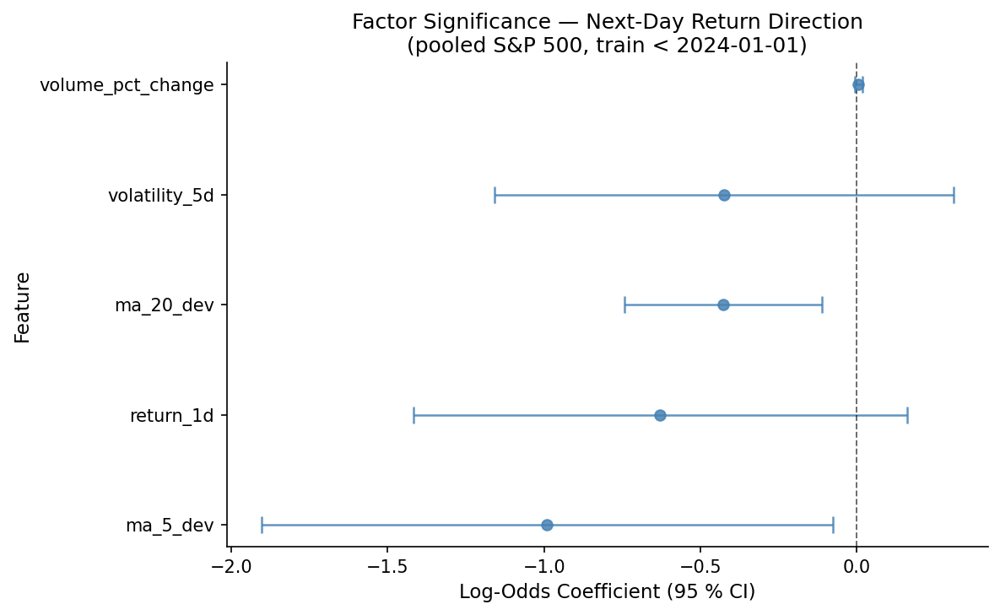

# Moving-Average Deviations Are the Only Statistically Significant Predictors of Next-Day Return Direction Across the S&P 500

## Hook

Price direction in equity markets is notoriously hard to predict. Across 498 S&P 500-universe tickers spanning decades of daily price history, a pooled logistic regression trained on five technical indicators identifies exactly two factors whose 95 % confidence intervals lie entirely away from zero: short-term and medium-term price deviation from moving averages. The remaining factors — yesterday's return, 5-day rolling volatility, and volume change — are statistically indistinguishable from noise.

## Problem Statement

Our general question is how to forecast stock prices. Specifically, we predict whether the next-day return is positive (up/down classification) across the S&P 500 universe. We asked a precise question: which of five commonly cited technical-indicator features — 1-day lagged return (`return_1d`), 5-day rolling volatility (`volatility_5d`), deviation from the 5-day moving average (`ma_5_dev`), deviation from the 20-day moving average (`ma_20_dev`), and volume percent change (`volume_pct_change`) — carry a statistically significant association with whether the next trading day's return is positive or negative?

We assembled a relational D1 dataset from public OHLCV history for ~498 S&P 500-universe tickers: four normalized tables (`tickers`, `daily_prices`, `daily_features`, `calendar`) joined in DuckDB. A strict time-based split (train: all rows before 2024-01-01; test: 124,686 rows from 2024 onward) prevents look-ahead bias. The binary outcome `y_up` equals 1 when the next day's return is positive.

## Solution Description

We built a clean, reproducible dataset from publicly available daily stock price history for ~498 S&P 500 companies, then ran a statistical test to find out which simple price signals actually predict whether tomorrow's return will be positive or negative.

We tested five signals: yesterday's return, recent price volatility, how far the current price sits above or below its short-term average (5-day), how far it sits from its medium-term average (20-day), and whether trading volume was higher or lower than usual.

The answer was clear: **only the moving-average deviation signals mattered**. When a stock's price has recently climbed well above its short- or medium-term average, it is slightly more likely to fall back the next day — a classic rubber-band effect. The other three signals (yesterday's return, volatility, and volume) showed no reliable relationship with next-day direction.

The model correctly predicted next-day direction **52.2 % of the time** on data from 2024 that it had never seen — a modest but consistent edge over random guessing. The signal is real, but small, which is exactly what you would expect in a competitive market where traders are constantly hunting for any exploitable pattern.

## Chart

The coefficient forest plot below shows each feature's log-odds estimate (center dot) and 95 % confidence interval (whiskers). Features whose entire CI lies to the left of the vertical dashed line at zero are statistically significant negative predictors of an up-day. `ma_5_dev` and `ma_20_dev` are the only two such factors.

Read the plot as follows: a CI entirely to the left of zero means higher values of that feature *decrease* the odds of a next-day up-move; a CI straddling zero means the factor is statistically consistent with no directional effect in this sample. The out-of-sample accuracy of 52.2 % confirms the signal is real but small — consistent with weak-form market efficiency, where technical signals exist but are rapidly arbitraged away in liquid markets.
